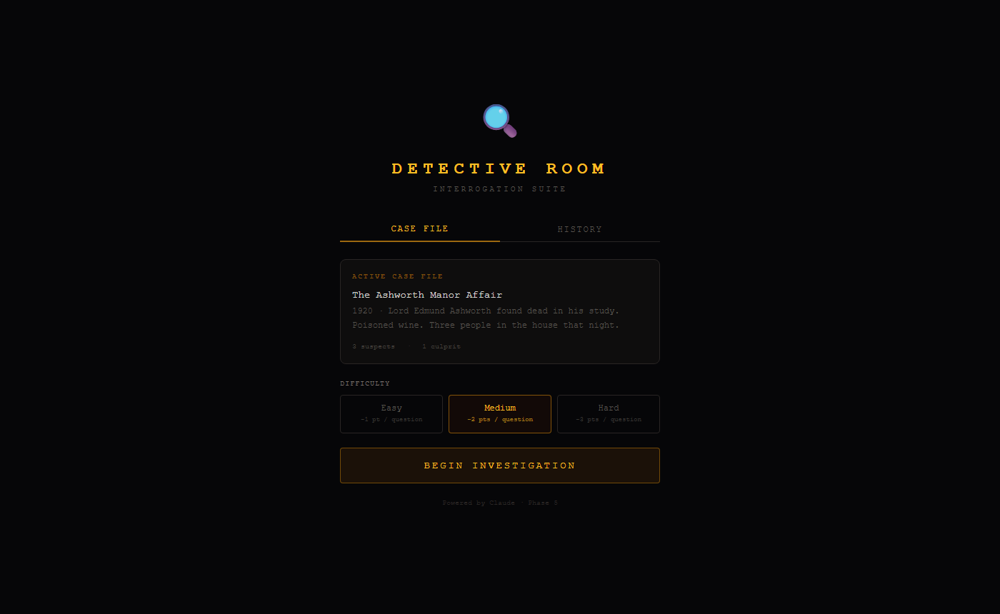
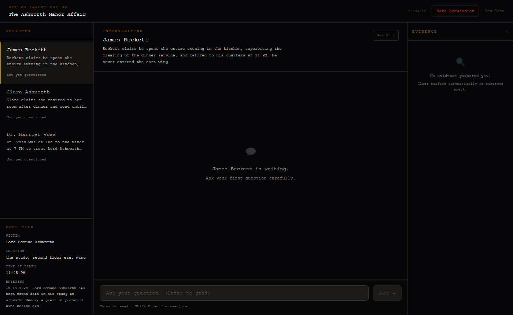
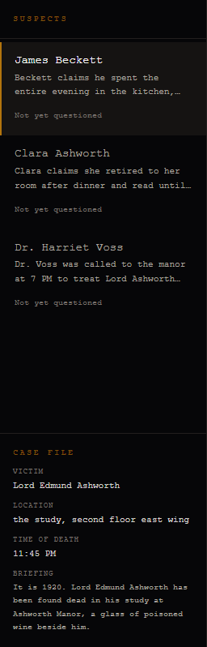
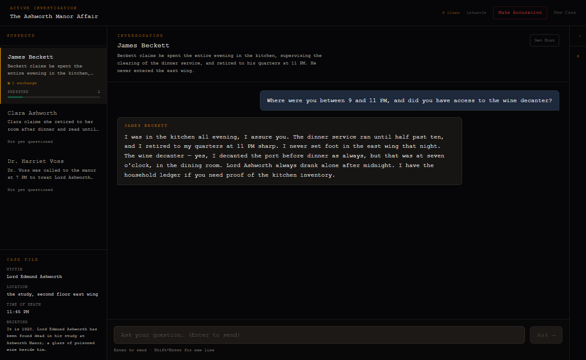
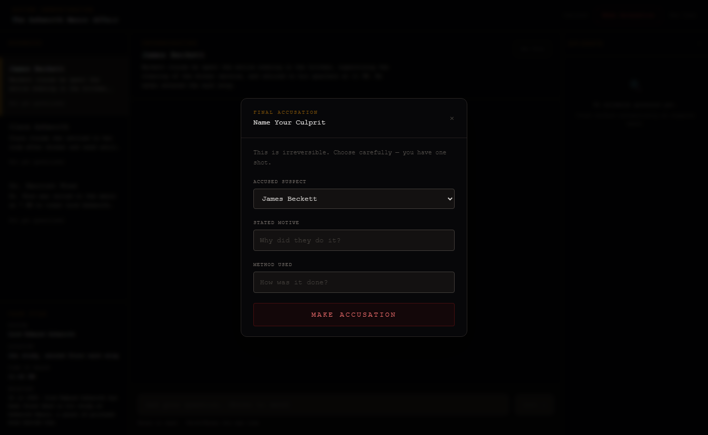
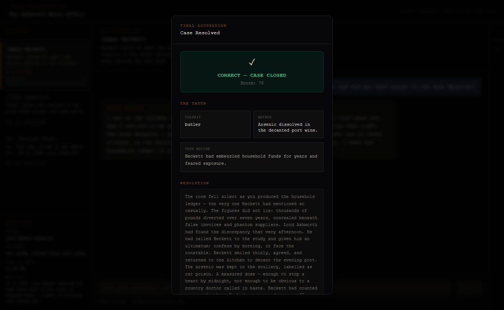

# 🕵️ Detective Interrogation Game

An AI-powered murder-mystery interrogation game where you question suspects, gather evidence, and accuse the culprit — all driven by **Claude AI** generating realistic character responses in real time.

> **Scenario:** *The Ashworth Manor Affair* — 1920. Lord Edmund Ashworth has been found dead in his study, a glass of poisoned wine beside him. Three suspects. One evening. Choose carefully who you pressure — and when.

---

## 📸 Screenshots

### Home — New Case & History


### Active Investigation


### Case File Sidebar


### Evidence Locker


### Making an Accusation


### Resolution


---

## 🏗️ System Design

```
┌─────────────────────────────────────────────────────────┐
│                      Browser (Next.js)                   │
│                                                         │
│  ┌───────────────┐  ┌──────────────┐  ┌─────────────┐  │
│  │ SuspectBoard  │  │  ChatPanel   │  │EvidenceLocker│  │
│  │ + Case File   │  │ SSE stream   │  │ Clue cards  │  │
│  └───────────────┘  └──────────────┘  └─────────────┘  │
│          │                 │                  │          │
│          └─────────────────┼──────────────────┘          │
│                     Zustand Store                        │
└─────────────────────────────────────────────────────────┘
                            │ HTTP / SSE
┌─────────────────────────────────────────────────────────┐
│                    FastAPI Backend                       │
│                                                         │
│  POST /new-game      → creates session, returns suspects│
│  GET  /session/:id   → reload / reconnect state         │
│  POST /chat          → SSE stream (tokens + metadata)   │
│  POST /accuse        → verdict + AI narrative           │
│  POST /hint          → cryptic clue from informant      │
│  GET  /history       → past game records                │
└─────────────────────────────────────────────────────────┘
                            │
              ┌─────────────┴──────────────┐
              │       Anthropic Claude      │
              │                            │
              │  • Character responses     │
              │  • Clue extraction tool    │
              │  • Consistency checker     │
              │  • Resolution narrative    │
              │  • Hint generation         │
              └────────────────────────────┘
```

### Request / Response Flow

```
Player types question
        │
        ▼
POST /chat ──────────────────────────────────────────────┐
        │                                                 │
        ▼                                                 │
Orchestrator builds prompt                               │
  • Character system prompt (role, backstory, alibi)    │
  • Full conversation history for this suspect          │
  • Difficulty modifier                                  │
        │                                                 │
        ▼                                                 │
Claude streams tokens ──► SSE: {type:"token", content}  │
        │                                                 │
        ▼                                                 │
Tools execute in parallel:                               │
  • extract_clues   → new evidence items                │
  • check_consistency → flag contradictions             │
  • update_pressure → raise/lower suspicion level       │
        │                                                 │
        ▼                                                 │
SSE: {type:"done", metadata:{pressure, clues, …}}  ◄────┘
        │
        ▼
Frontend updates store:
  • Appends character message
  • Merges new clues into Evidence Locker
  • Animates pressure meter
```

---

## 🗂️ Project Structure

```
detective-interrogation/
├── backend/                        # FastAPI Python backend
│   ├── app/
│   │   ├── agents/
│   │   │   ├── orchestrator.py     # Builds Claude prompt, runs tools, streams SSE
│   │   │   ├── mock_responses.py   # Offline responses for development
│   │   │   └── tools/
│   │   │       ├── clue_extractor.py   # Claude tool: extract_clues
│   │   │       ├── consistency.py      # Claude tool: check_consistency
│   │   │       └── pressure.py         # Claude tool: update_pressure
│   │   ├── api/
│   │   │   ├── deps.py             # Shared FastAPI dependencies
│   │   │   └── routes/
│   │   │       ├── game.py         # POST /new-game, GET /session/:id
│   │   │       ├── chat.py         # POST /chat  (SSE streaming)
│   │   │       ├── accuse.py       # POST /accuse
│   │   │       ├── hint.py         # POST /hint
│   │   │       └── history.py      # GET /history
│   │   ├── core/
│   │   │   ├── config.py           # Env-var settings (API key, CORS)
│   │   │   ├── session_store.py    # In-memory session map
│   │   │   └── history_store.py    # JSON file persistence (history.json)
│   │   ├── models/
│   │   │   ├── game.py             # NewGameRequest/Response, CaseBrief
│   │   │   ├── chat.py             # ChatRequest, SSE event types
│   │   │   ├── session.py          # GameSessionModel
│   │   │   ├── history.py          # GameRecord
│   │   │   └── scenario.py         # ScenarioModel (loaded from JSON)
│   │   ├── prompts/
│   │   │   ├── character_system.py # Per-suspect system prompt builder
│   │   │   └── resolution.py       # Resolution narrative prompt
│   │   └── services/
│   │       ├── game_service.py     # start_new_game()
│   │       ├── session_service.py  # CRUD helpers for sessions
│   │       ├── scenario_service.py # Load scenario JSON
│   │       ├── hint_service.py     # generate_hint() via Claude
│   │       └── resolution_service.py # generate_narrative() via Claude
│   ├── scenarios/
│   │   └── manor_1920.json         # The Ashworth Manor Affair scenario data
│   ├── tests/
│   │   ├── unit/                   # 60+ unit tests (pytest)
│   │   └── integration/            # Integration tests (require running server)
│   ├── requirements.txt
│   └── history.json                # Runtime — gitignored
│
├── frontend/                       # Next.js 14 App Router frontend
│   └── src/
│       ├── app/
│       │   ├── page.tsx            # Home: new game + history tabs
│       │   └── game/[sessionId]/
│       │       └── page.tsx        # Game screen (3-panel layout)
│       ├── components/
│       │   ├── suspects/
│       │   │   └── SuspectBoard.tsx    # Suspect list + Case File sidebar
│       │   ├── chat/
│       │   │   ├── ChatPanel.tsx       # Interrogation panel + hint banner
│       │   │   ├── ChatInput.tsx       # Textarea + send button
│       │   │   └── MessageBubble.tsx   # Styled player / character bubbles
│       │   ├── evidence/
│       │   │   └── EvidenceLocker.tsx  # Collapsible clue board
│       │   ├── accusation/
│       │   │   └── AccusationModal.tsx # Suspect / motive / method form + verdict
│       │   └── history/
│       │       └── HistoryPanel.tsx    # Past games table with stats
│       ├── hooks/
│       │   └── useChat.ts          # SSE stream handler
│       ├── stores/
│       │   └── gameStore.ts        # Zustand global store
│       └── lib/
│           ├── api.ts              # Typed fetch wrappers for every endpoint
│           └── types.ts            # TypeScript interfaces (mirrors Pydantic models)
│
├── docs/
│   └── screenshots/                # UI screenshots for this README
├── PLAN.md                         # Original phase-by-phase build plan
└── README.md
```

---

## ⚙️ Tech Stack

| Layer | Technology |
|---|---|
| Frontend | Next.js 14 (App Router), TypeScript, Tailwind CSS |
| State | Zustand |
| Backend | FastAPI, Python 3.11+ |
| AI | Anthropic Claude (claude-sonnet) via `anthropic` SDK |
| Streaming | Server-Sent Events (SSE) |
| Persistence | In-memory sessions + JSON file for history |
| Testing | Vitest (frontend), pytest + pytest-asyncio (backend) |

---

## 🎮 Gameplay

### Phases
| Phase | Description |
|---|---|
| **Investigation** | Question suspects freely. Each has their own memory. |
| **Accusation** | Submit your suspect + motive + method. |
| **Resolution** | AI generates a reveal narrative. Score calculated. |

### Scoring
| Difficulty | Per question | Wrong accusation |
|---|---|---|
| Easy | −1 pt | −20 pts |
| Medium | −2 pts | −30 pts |
| Hard | −3 pts | −40 pts |

Starting score is **100**. Every question you ask reduces it, so efficient interrogation wins.

### Pressure System
Each suspect has a hidden **pressure threshold**. Aggressive questioning raises their pressure level (shown as a meter). Above the threshold, suspects become more likely to slip up or contradict themselves.

---

## 🚀 Running Locally

### Prerequisites
- Python 3.11+
- Node.js 18+
- An Anthropic API key (get one at [console.anthropic.com](https://console.anthropic.com))

### Backend
```bash
cd backend
python -m venv .venv
.venv\Scripts\activate          # Windows
# source .venv/bin/activate     # macOS / Linux

pip install -r requirements.txt

# Create .env from the example
copy .env.example .env          # Windows
# cp .env.example .env          # macOS / Linux
# Then add your ANTHROPIC_API_KEY to .env

uvicorn app.main:app --reload --port 8000
```

API docs available at [http://localhost:8000/docs](http://localhost:8000/docs)

### Frontend
```bash
cd frontend
npm install
npm run dev
```

Open [http://localhost:3000](http://localhost:3000)

### Running Tests

**Backend**
```bash
cd backend
.venv\Scripts\activate
pytest tests/unit/ -v
```

**Frontend**
```bash
cd frontend
npm test
```

---

## 🔌 API Reference

### `POST /new-game`
Start a new investigation session.

**Request**
```json
{ "scenario_id": "manor_1920", "difficulty": "medium" }
```

**Response**
```json
{
  "session_id": "uuid",
  "scenario_title": "The Ashworth Manor Affair",
  "suspects": [{ "id": "butler", "name": "James Beckett", "cover_story": "…" }],
  "case_brief": {
    "victim": "Lord Edmund Ashworth",
    "location": "The study, Ashworth Manor",
    "time_of_death": "Between 9 PM and midnight",
    "scenario_title": "The Ashworth Manor Affair",
    "setting": "It is 1920…"
  }
}
```

### `POST /chat`  *(SSE)*
Send a player message and stream the suspect's response.

**Request**
```json
{ "session_id": "uuid", "suspect_id": "butler", "message": "Where were you at 10 PM?" }
```

**Stream events**
```
data: {"type":"token",   "content":"I was in the kitchen, as I told—"}
data: {"type":"token",   "content":"the constable already."}
data: {"type":"done",    "metadata":{"new_pressure_level":3,"new_clues":[…],"pressure_delta":1}}
```

### `POST /accuse`
Submit your accusation and receive the verdict + narrative.

**Request**
```json
{
  "session_id": "uuid",
  "suspect_id": "butler",
  "motive": "He was about to be dismissed…",
  "method": "Poisoned the wine decanter…"
}
```

**Response**
```json
{
  "is_correct": true,
  "correct_culprit_id": "butler",
  "score": 74,
  "resolution_narrative": "The room fell silent as you produced the ledger…"
}
```

### `POST /hint`
Get a cryptic hint from your informant. Never names the culprit directly.

### `GET /history`
Returns all past completed games, newest first.

---

## 🧠 AI Architecture

Every suspect response is generated fresh by Claude with:

- **Character system prompt** — name, backstory, cover story, what they're hiding, their alibi hole, their pressure threshold, and the full crime truth (known only to Claude)
- **Full conversation history** — suspects remember every prior exchange *within the session*
- **Three parallel tools Claude can call:**
  - `extract_clues` — identifies factual clues in the response and returns structured `ExtractedClue` objects
  - `check_consistency` — flags contradictions with previous statements
  - `update_pressure` — calculates the new pressure delta based on question aggressiveness

The hint and resolution narrative are separate one-shot Claude calls with specialised prompts.

---

## 🗺️ Roadmap

- [ ] Additional scenarios (country house, locked office, cruise ship)
- [ ] Redis session store for multi-server deployment
- [ ] Multiplayer / spectator mode
- [ ] Leaderboard across players
- [ ] Suspect portraits (AI-generated)

---

## 📄 License

MIT
